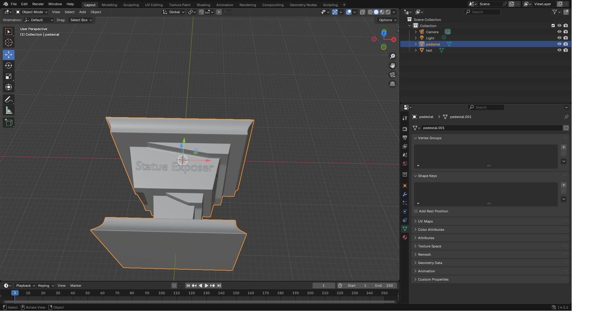

# WebGL 3D Viewer

This project is a feature-rich WebGL-based 3D viewer that allows users to load, display, and interact with 3D models in real-time directly within a web browser. It includes advanced features such as camera controls, environment mapping, and dynamic texture application.

## Features

- Load and render 3D models in `.OBJ` format.
- Apply dynamic textures for realistic rendering.
- Environment mapping for reflective surfaces.
- Real-time camera controls (keyboard and on-screen sliders).
- Responsive design for desktop and mobile usage.
- Model rotation using touch gestures or control panel buttons.
- Interactive user interface for uploading custom models and textures.

## Folder Structure

```
.vscode/ 
    settings.json  # Editor configuration

data/ 
    mickeyMouse/   # Example 3D model assets 
    pedestal/      # Custom pedestal model with text "Statue Exposer" 
    skybox/        # Environment texture files for creating the skybox

js/ 
    # Core JavaScript files for application functionality 
    main.js        # Entry point 
    shaders.js     # Shaders for rendering 
    skybox.js      # Skybox creation 
    ...            # Additional utility files

resources/ 
    # Supporting libraries 
    statueExposer.html  # Main HTML file
```

## How to Use

1. Open `statueExposer.html` in a modern web browser with WebGL support.
2. Use the control panel and keyboard for interaction:
     - **Sliders**: Adjust field of view and camera position.
     - **Keyboard**: Move the camera with `W`, `A`, `S`, `D`, and arrow keys.
     - **Gestures**: Rotate the model using touch or mouse.
     - **File Inputs**: Upload new `.OBJ` models or textures.

## Modeling the Pedestal

The custom pedestal was modeled in Blender with the text "Statue Exposer" integrated on its front face. The steps included:
1. Creating a basic shape using primitives.
2. Adding and positioning text as a 3D object.
3. Merging the text into the geometry using Boolean operations.
4. Exporting the model in `.OBJ` format.



## Shaders

Shaders, written in `shaders.js`, power the rendering pipeline with:
- Lighting calculations.
- Texture mapping.
- Environment mapping for immersive visuals.

## Screenshot


## Conclusion

The WebGL 3D Viewer showcases the capabilities of modern web technologies to create interactive 3D applications. Its responsive design and advanced features make it a versatile tool for model visualization across devices.

## Author
- [Vittorio Rossetto](https://github.com/VittorioRossetto)

